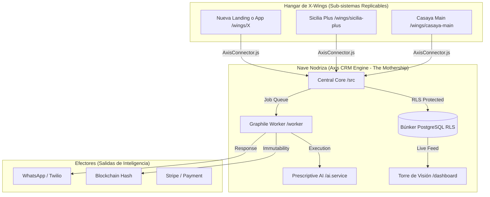

# Estado del Proyecto - Axis CRM Engine 🚀

Este documento es el **Mapa Maestro de Ingeniería** del búnker. Representa la culminación de la Fase de Infraestructura Industrial y la Unificación de Subsistemas.

## 🎖️ Búnker Certificado (Nivel Capital) ✅

El sistema es una **Plataforma Industrial SaaS** blindada, diseñada para la soberanía del dato y la conversión de alto rendimiento.

### 🛰️ Mapa del Ecosistema Unificado (Mothership & X-Wings)

Este mapa representa la arquitectura final de la **Fase 7**, donde la inteligencia central (Nave Nodriza) coordina a los subsistemas de captura (X-Wings).

### 🛡️ Componentes del Ecosistema

1.  **Nave Nodriza (Mothership)**: El motor central que reside en Railway. Contiene la lógica de negocio, la seguridad RLS y el cerebro de IA.
2.  **X-Wings (Subsistemas)**: Front-ends modulares y ligeros. Son "sensores" de entrada que pueden ser desplegados independientemente (Netlify/Vercel) pero reportan al mismo cerebro.
3.  **AxisConnector.js**: El "Cordón Umbilical" universal. Un script estandarizado que permite a cualquier X-Wing conectarse al búnker con una API Key y un Project ID.
4.  **Torre de Visión (Dashboard)**: Centro de mando para el Arquitecto (Andres Abel), permitiendo la vigilancia total de los leads capturados por todas las naves.

### 🕹️ Tablero de Control de Proyectos

Cada X-Wing está vinculada a un proyecto en la base de datos, lo que permite encender o apagar módulos de inteligencia por separado:

- **Proyecto Casaya Main**: Branding + IA Prescriptiva (ON) + Blockchain (ON).
- **Proyecto Sicilia Plus**: Conversión Rápida + IA Prescriptiva (ON) + Speed to Lead (ON).

### ⚔️ El Arsenal (Ofensiva Proactiva) - NUEVO ⚡

Se ha integrado una capa de **Inteligencia Ofensiva** que permite al sistema dejar de ser reactivo (esperar leads) para ser proactivo (cazar oportunidades y detectar amenazas).

1.  **Avión Espía (OSINT)**: Sensor estratosférico que monitorea señales de mercado masivas.
2.  **Protocolo Infiltrador (Digital HUMINT)**: Droides humanizados con "Personas Sintéticas" que se infiltran en foros, redes sociales y mercados oscuros.
3.  **Vader Watch**: Panel de detección de amenazas en tiempo real para identificar agentes hostiles o competidores agresivos.

### 🌌 Fase 9: El Ejército de Droides Autónomos (The Droid Army) - EN DESARROLLO 🛠️

Para dominar el mercado, necesitamos motores que no solo observen, sino que actúen de forma autónoma.

1.  **Cerebro de Enjambre (Swarm Intelligence)**: Orquestador de múltiples droides que colaboran para rodear a un objetivo desde diferentes plataformas.
2.  **Cañón de Iones (Automated Effectors)**: Respuesta automatizada y personalizada. Si el escáner detecta una vulnerabilidad, el cañón dispara un mensaje diseñado para convertir o neutralizar.
3.  **Escudo de Invisibilidad (Tor/Proxy Mesh)**: Capa de anonimato total. Cada petición del arsenal sale por un nodo diferente en la galaxia, haciendo que el búnker sea inrastreable. **ESTADO: ACTIVO 🛡️**

**Estado Actual:** Fase 9 (Ejército de Droides) - Artillería Pesada Desplegada.
**Última Actualización:** 28 de Marzo, 2026.
